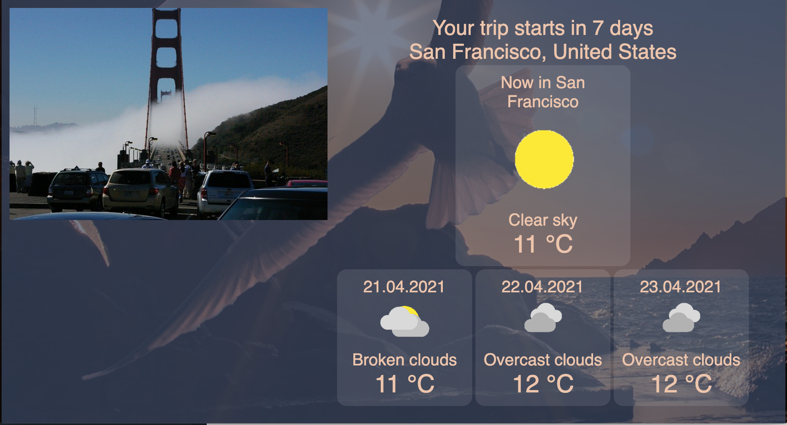

# Weather-Journal App Project

## **Introduction**

This project is a simple weather application for my Udacity Nanodegree course.
The goal of this project is to create an asynchronous web app that uses Web API and user data to dynamically update the UI.

The application:

1. Displays a form where you can write a zip code (now it's work only for German zip codes) and you can write how you feel today.
   
2. After you click on the "Generate" button you will get an information about weather in the city, which zip code was written before.
   

## **Getting Started**

### Getting Setup

#### Installing Node and NPM

This project depends on Nodejs and Node Package Manager (NPM). Before continuing, you must download and install Node (the download includes NPM) from [https://nodejs.com/en/download](https://nodejs.org/en/download/).

#### Installing Express Environment

For setting up a local server install the Express package from the terminal in the directory, where server.js file is. Run:

```bash
npm install express
```

#### Installing project dependencies

For install `cors` and `body-parser` open your terminal in the directory, where server.js file is and run:

```bash
npm install cors
npm install body-parser
```

### API Credentials

Create API credentials on OpenWeatherMap.com and put it in the app.js file on the variable named `apiKey`.

### Run Local Server

For running local server in the main directory of project run command:

```bash
node server.js
```

Open [http://localhost:8000](http://localhost:8000) to view it in the browser.
